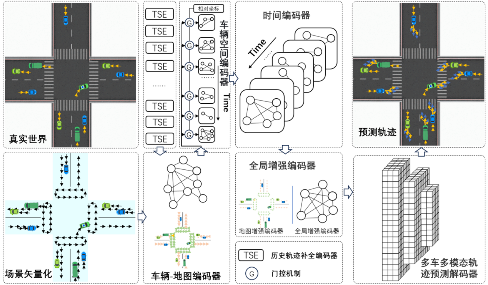
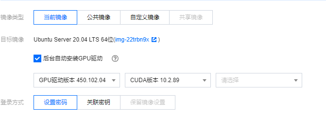

# GSTA：GNN时空注意力轨迹预测模型

## 环境搭建流程
环境搭建过程需要严格遵守版本一致性

1. 操作系统及GPU驱动、cuda版本

2. 安装python环境
```
wget https://mirrors.bfsu.edu.cn/anaconda/archive/Anaconda3-2022.10-Linux-x86_64.sh --no-check-certificate
bash Anaconda3-2022.10-Linux-x86_64.sh
记得要conda init
```
3. 刷新环境变量
```
source ~/.bashrc
```
4. 查看cuda版本
```
nvcc --version
```
5. 创建环境并安装与cuda对应版本的torch，根据上面cuda版本，本实例可选择torch==1.8.0
```
conda create --name gsta
pip install torch==1.8.0+cu101 --extra-index-url https://download.pytorch.org/whl/cu101
```
6. 安装[argoverse-api-1.1.0](env/argoverse-api-1.1.0.zip)\
  将压缩包解压，并将[hd_map.tar.gz](env/hd_map.tar.gz)解压到argoverse-api-1.1.0目录内，直行命令:
```
pip install -e ./argoverse-api-1.1.0/
```
7. 安装geometric依赖的三方件\
   https://pytorch-geometric.com/whl/
   在网址找到与torch版本以及cuda版本对应的whl，通过pip install进行安装，本示例已整理在此压缩文件
  [whls.zip](env/whls.zip)
8. 安装geometric
```
pip install pytorch-geometric==1.7.2
```
9. 安装lightning
```
pip install pytorch-lightning==1.5.2
```
这一步执行成功后torch可能被升级，需要将torch版本进行回退


## 下载数据
```
wget https://s3.amazonaws.com/argoverse/datasets/av1.1/tars/forecasting_val_v1.1.tar.gz
wget https://s3.amazonaws.com/argoverse/datasets/av1.1/tars/forecasting_test_v1.1.tar.gz
wget https://s3.amazonaws.com/argoverse/datasets/av1.1/tars/forecasting_train_v1.1.tar.gz
```
下载到指定目录，并解压

## 训练
```
python train.py --root /dataset_base_path/ --embed_dim 64
```

## 验证
```
python eval.py --root /dataset_base_path/ --batch_size 32 --ckpt_path /path_to_your_checkpoint.ckpt
```
